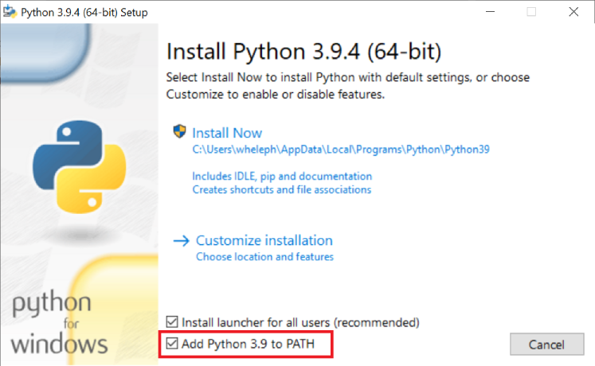
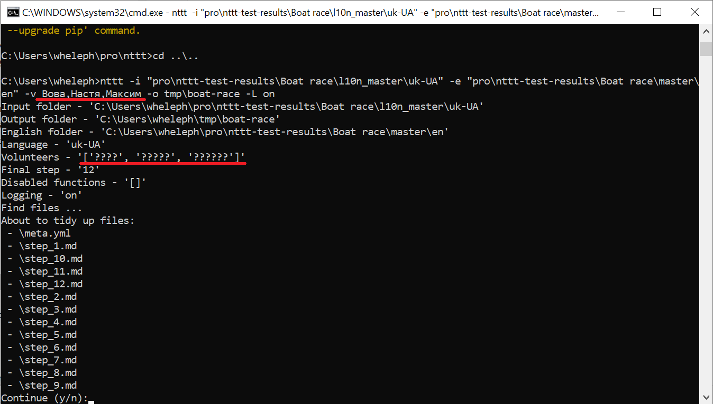
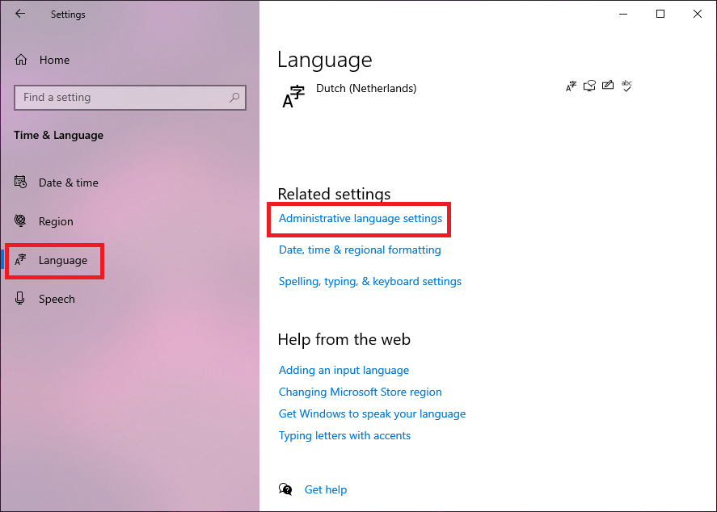
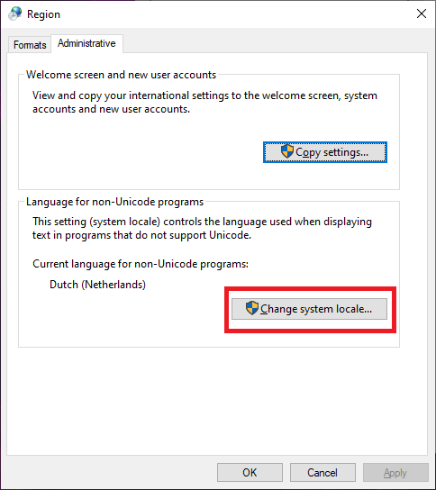
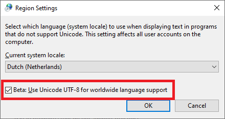
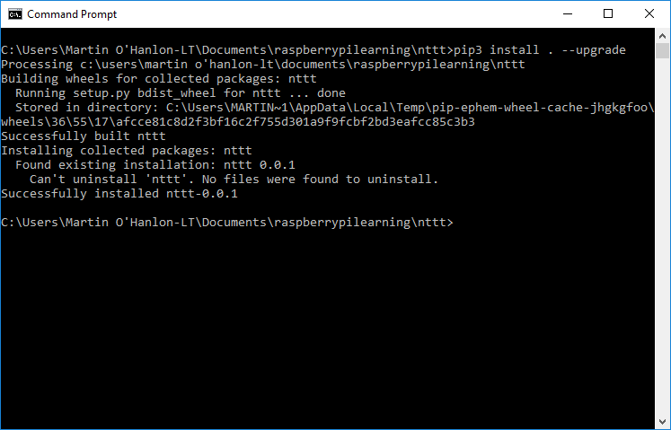
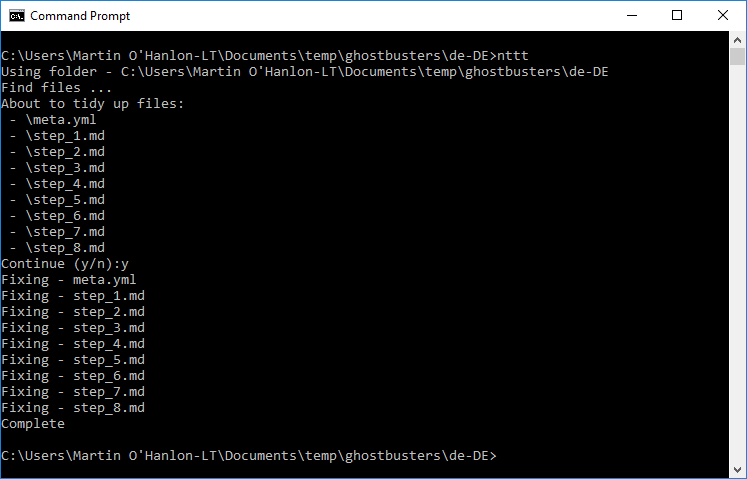

# NTTT

"Nina's Translation Tidy-up Tool"

Note - NTTT will work on Windows, macOS and Linux.

## Prerequisites

The tool requires having Python 3.7 or newer. 
Please ensure that you have a proper version of Python installed by issuing 
`python3 --version` on command line.

### Python on Windows

It's recommended to [download Python installer from python.org](https://www.python.org/downloads/) 
rather than getting it from Microsoft Store. This is because the version from Microsoft Store 
doesn't add [the location of scripts from Python packages](https://python-packaging.readthedocs.io/en/latest/command-line-scripts.html) 
to the environment variable `PATH`. This leads to inconvenience because each time you'll want to run NTTT, you'll need to
provide the full path to the installed binary including all directories rather than just typing `nttt`.

If you choose to use installer from python.org then make sure to check "Add Python 3.x to PATH":


If you must use Python from Microsoft Store then please make sure to add the location of scripts from Python packages 
(something like `C:\Users\wheleph\AppData\Local\Packages\PythonSoftwareFoundation.Python.3.9_qbz5n2kfra8p0\LocalCache\local-packages\Python39\Scripts`) 
to the environment variable `PATH` manually.

### UTF-8 support on Windows

The Command Prompt on Windows only supports the character sets for Western languages. 
As a result you may see that non-latin symbols are replaced by "?":


For other languages, UTF-8 support may have to be enabled. 
This is only available on newer version of Windows 10. Windows 7, 8 and 8.1 do not support this. 
To enable UTF-8 support in the Command Prompt, open the Settings, select Time & Language and 
open the Language section. Scroll down and select the __Administrative language settings__ link:


In the window that pops up, select the *Change system locale...* button:


Finally, tick the checkbox Beta: Use Unicode UTF-8 for worldwide language support:


## Install

To install NTTT, clone the repository and use `pip3` to install:

```bash
git clone https://github.com/wheleph/nttt
cd nttt
pip3 install -r requirements.txt
pip3 install . --upgrade
```



You can uninstall nttt using:

```bash
pip3 uninstall nttt
```

## Usage

NTTT is a command line tool, called using `nttt`.

Navigate to the directory you want to tidy up and run NTTT:

```bash
cd path\to\project\de-DE
nttt
```

NTTT will search for all relevant files and ask you to confirm before updating.




### Input and output directories

You can specify different directories for the input and output folder using the `-i`/`--input` and `-o`/`--output` options:

```bash
nttt --input c:\path\to\project\de-DE --output c:\path\to\project\de-DE-tidy
```

### Help

To bring up full usage information use the `-h`/`--help` option.

```bash
nttt -h

usage: nttt [-h] [-i INPUT] [-o OUTPUT] [-e ENGLISH] [-l LANGUAGE] [-v VOLUNTEERS] [-f FINAL]

Nina's Translation Tidyup Tool

optional arguments:
  -h, --help            Show this help message and exit.
  -i INPUT, --input INPUT
                        The input directory which contains the content to tidy
                        up, defaults to the current folder.
  -o OUTPUT, --output OUTPUT
                        The output directory where the upgraded content should
                        be written, defaults to the same as input.
  -e ENGLISH, --english ENGLISH
                        The directory which contains the English files and
                        folders, defaults to INPUT/../en.
  -l LANGUAGE, --language LANGUAGE
                        The language of the content to be tidied up, defaults
                        to basename(INPUT).
  -v VOLUNTEERS, --volunteers VOLUNTEERS
                        The list of volunteers as a comma separated list,
                        defaults to an empty list.
  -f FINAL, --final FINAL
                        The number of the final step file, defaults to the
                        step file with the highest number.

examples of usage:
  nttt
    Use the current directory (.) as input and output directory, ../en
    (..\en on Windows) as English directory, and the last part of the
    full path to the current directory as language. No volunteer names
    will be added to the final step file and the step file with the
    highest number is used as final step file.

  nttt -i path/to/project/de-DE (macOS and Linux)
  nttt -i path\to\project\de-DE (Windows)
    Use path/to/project/de-DE (path\to\project\de-DE on Windows) as input
    and output directory, path/to/project/en as English directory and de-DE
    as language. No volunteer names will be added to the final step file
    and the step file with the highest number is used as final step file.

  nttt -o ../output (macOS and Linux)
  nttt -o ..\output (Windows)
    Use the current directory (.) as input directory, ../output
    (..\output on Windows) as output directory, ../en
    (..\en on Windows) as English directory, and the last part of the
    full path to the current directory as language. No volunteer names
    will be added to the final step file and the step file with the
    highest number is used as final step file.

  nttt -e some/other/path/en (macOS and Linux)
  nttt -e some\other\path\en (Windows)
    Use the current directory (.) as input and output directory,
    some/other/path/en (some\other\path\en on Windows) as English
    directory, and the last part of the full path to the current
    directory as language. No volunteer names will be added to the
    final step file and the step file with the highest number is
    used as final step file.

  nttt -l hi-IN
    Use path/to/project/de-DE (path\to\project\de-DE on Windows) as input
    and output directory, path/to/project/en as English directory and hi-IN
    as language. No volunteer names will be added to the final step file
    and the step file with the highest number is used as final step file.

  nttt -v "Volunteer Translator, Volunteer Reviewer, Volunteer Tester"
    Use the current directory (.) as input and output directory, ../en
    (..\en on Windows) as English directory, and the last part of the
    full path to the current directory as language. Three volunteer names
    are added to the final step file: "Volunteer Translator",
    "Volunteer Reviewer" and "Volunteer Tester". The step file with the
    highest number is used as final step file.
    Note that the list of volunteer names should be enclosed in quotes.
    Also note that spaces at the beginning and end of the list as well
    as spaces before and after commas will be discarded.

  nttt -f 7
    Use the current directory (.) as input and output directory, ../en
    (..\en on Windows) as English directory, and the last part of the
    full path to the current directory as language. No volunteer names
    will be added to the final step file. File step_7.md will be used as
    final step file.

  nttt -i path/to/project/de-DE -o ../output -e some/other/path/en -l hi-IN \
       -v "Volunteer Translator, Volunteer Reviewer, Volunteer Tester" -f 7
    Use path/to/project/de-DE as input directory, ../output as output
    directory, some/other/path/en as English directory, and hi-IN as
    language. Three volunteer names are added to the final step file:
    "Volunteer Translator", "Volunteer Reviewer" and "Volunteer Tester".
    File step_7.md will be used as final step file.
```

## Spreadsheets

NTTT requires the volunteer acknowledgements spreadsheet (a Google Sheet) to be published as CSV file. This has to be done only once. Any changes in the spreadsheet will automatically appear in the published CSV file, although after a delay of at most 5 minutes:


Use the following procedure to publish the volunteer acknowledgements spreadsheet (only the NEW sheet) in CSV format:
1. Open the spreadsheet in Google Sheets.
2. Select **File** > **Publish** to the web from the menu.
3. Make sure **Link** is selected.
4. Instead of **Entire Document**, select **NEW**.
5. Instead of **Web Page**, select **Comma-separated values (.csv)**.
6. Click the **Publish** button.
7. Click **OK for** publishing this selection.
8. Copy the resulting URL (the long string starting with https and ending with csv) and hand it over to the development team to include the URL in the code of NTTT.

# Contributors

A massive thanks to the community contributors who spent time updating and improving this tool, you took what we had and ran with it.

<a href = "https://github.com/raspberrypilearning/nttt/graphs/contributors">
  
</a>

Made with [contributors-img](https://contrib.rocks).
